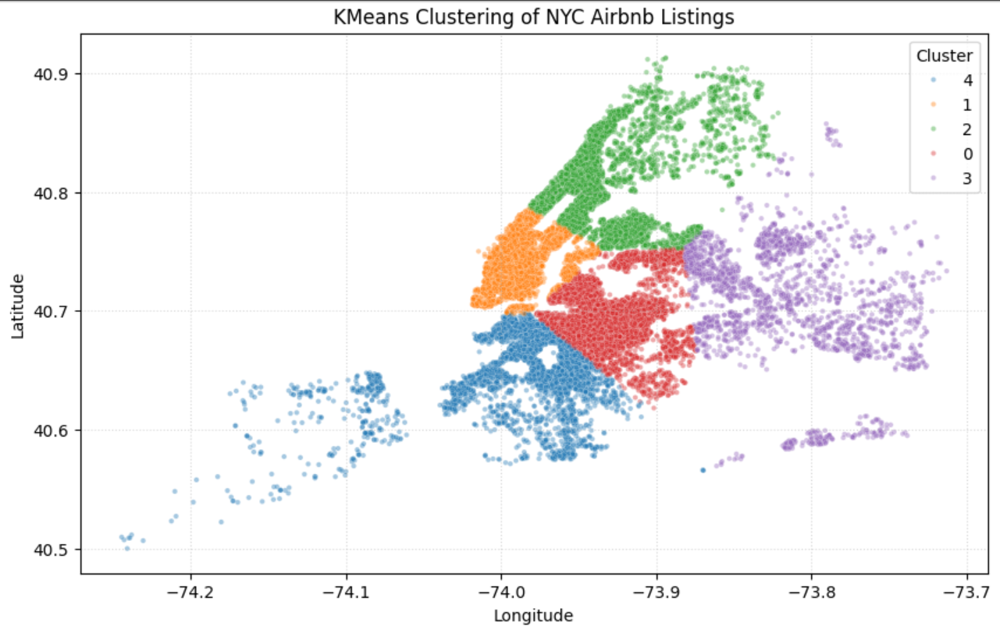
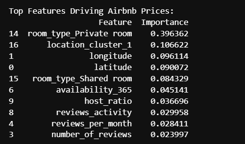
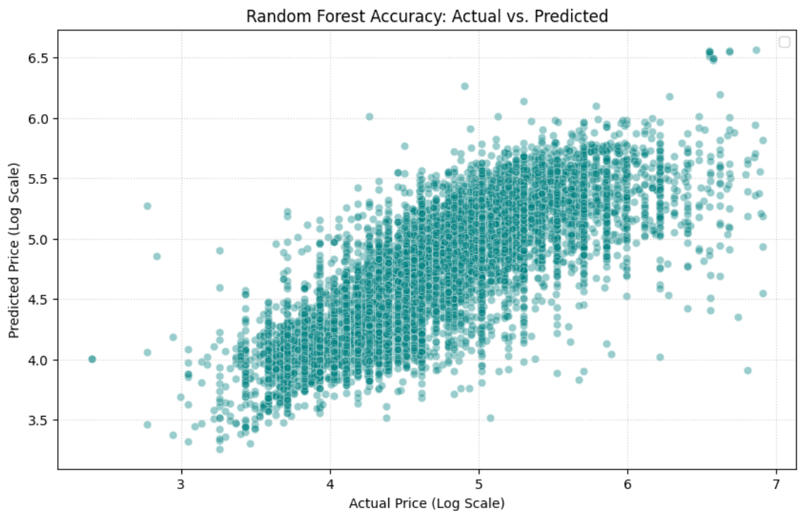

# NYC Airbnb Price Prediction 🗽

## 📌 Problem Statement
The goal of this project is to build a machine learning regression model to predict Airbnb listing prices with reasonable accuracy in New York City. By analyzing property attributes, location data, and host metrics, this project provides data-driven pricing strategies to help hosts optimize their rental income and remain competitive in the dynamic NYC market.

## 📊 Dataset Information
* **Source:** NYC Airbnb 2019 Dataset
* **Size:** 48,895 unique listings
* **Key Features:** Location coordinates (latitude/longitude), neighbourhood groups, room type, minimum nights, availability (365 days), reviews per month, and host listing counts.

**Note:** Due to GitHub's file size limits, the trained Random Forest model (.pkl) is too large to host directly. Download the trained model [here](https://drive.google.com/file/d/1-3yYZcwRaOrjLC61ih1kCgo4BFOf8C6G/view?usp=drive_link).
  
## 🛠️ Tools & Technologies Used
* **Programming Language:** Python
* **Data Manipulation:** `pandas`, `numpy`
* **Machine Learning:** `scikit-learn` (Random Forest, Gradient Boosting, Linear Regression, KMeans Clustering)
* **Data Visualization:** `matplotlib`, `seaborn`

## ⚙️ Steps Performed
1. **Data Cleaning:** Addressed missing values (e.g., imputing `reviews_per_month` with 0), handled invalid review dates, and removed duplicate entries.
2. **Feature Engineering:** * Applied log transformations to handle highly skewed variables like `price` and `minimum_nights`.
   * Formulated new derived metrics: `reviews_activity` and `host_ratio`.
   * Performed **KMeans Clustering** on geospatial coordinates (latitude/longitude) to categorize properties into distinct location-based pricing clusters.
3. **Data Preprocessing:** Scaled numerical features using `StandardScaler` and applied `OneHotEncoding` to categorical attributes.
4. **Model Training & Evaluation:** Trained Linear Regression (baseline), Gradient Boosting Regressor, and Random Forest Regressor models to predict the log-transformed price.

## 🏆 Key Insights & Results
The **Random Forest Regressor** emerged as the best-performing model, successfully capturing the non-linear relationships within the data.
* **R² Score:** `0.6465`
* **RMSE:** `0.3886`

**Business Takeaways:**
* **Location is King:** The location cluster (particularly proximity to prime areas like Manhattan) is the most dominant factor influencing price.
* **Space Commands a Premium:** 'Entire home/apt' listings are priced significantly higher than private or shared rooms.
* **Visibility Matters:** Listings with high availability and active review engagement signal higher demand, impacting the optimal price point.

## 📸 Screenshots & Visualizations

### 1. Geospatial Pricing Clusters

*KMeans clustering of NYC Airbnb properties based on latitude and longitude.*

### 2. Feature Importance

*Top features driving Airbnb prices according to the Random Forest model.*

### 3. Actual vs. Predicted Prices

*Scatter plot showcasing the accuracy of the Random Forest Regressor on test data.*
